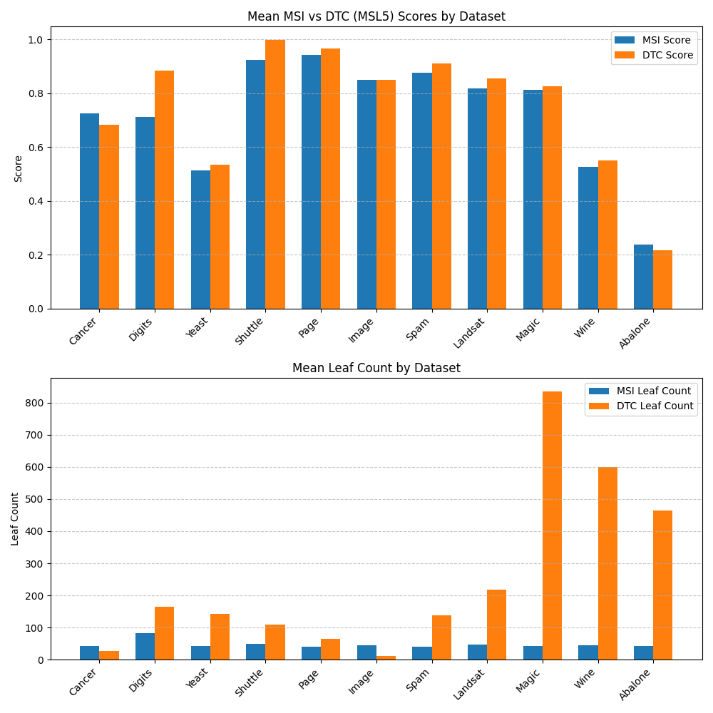

# HyperfreeDT

## Description
This is an implementation of the decision tree creation algorithm from
[A Novel Hyperparameter-free Approach to Decision Tree Construction that Avoids Overfitting by Design](https://arxiv.org/pdf/1906.01246).

This tree construction method differs from other methods in two important aspects:
- There are no hyperparameters to tune
- The generated decision trees are much smaller

## Prerequisites

### System Requirements
- Python 3.8+
- pip
- virtualenv (recommended)

## Installation

1. Clone the repository:
```bash
git clone https://github.com/gkoundry/hyperfreedt.git
cd hyperfreedt
```

2. Create a virtual environment:
```bash
python -m venv venv
source venv/bin/activate  # On Windows, use `venv\Scripts\activate`
```

3. Install dependencies:
```bash
pip install -r requirements.txt
```

## Usage

### Creating a tree and generating predictions (class probabilities)
The features should be contained in a numeric numpy array while the labels should be
a numpy array of {0, 1} for binary classification or [0, N-1] for multiclass.

```python
import numpy as np
from hyperfreedt import build_tree, predict, print_tree

# create test data 
x = np.random.rand(1000, 5)
y = np.sum(x, axis=1) + np.random.normal(0, 1, 1000)
y = (y > np.mean(y)).astype(int)

# Build decision tree
tree = build_tree(x, y)

# Show tree structure
print_tree(tree)

# Get predicted class probabilities
predicted_probs = predict(tree, x)
```

### Benchmarks
To reproduce the benchmark from the paper run the following:
```bash
pip install -r requirements_bench.txt
```

Then run:
```bash
python benchmark.py
```

Result:


## Contact

Glen Koundry - gkoundry@gmail.com
